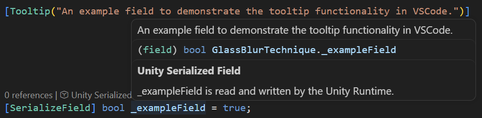

# VS Code Unity Tooltip Hover

[](LICENSE)
[](https://github.com/TheJoshuaEvans/VSCodePluginUnityTooltip/releases/latest)

A VS Code extension that shows a Unity field's `[Tooltip("...")]` attribute text as IDE hover documentation.



## Installation

To install directly:

1. Download the `.vsix` from the [latest release](https://github.com/TheJoshuaEvans/VSCodePluginUnityTooltip/releases/latest).
2. Install it: `code --install-extension path/to/vscode-unity-tooltip-hover-*.vsix` (or use the Extensions view's "Install from VSIX..." command).
3. Reload VS Code - a newly installed extension doesn't hot-load into an already-open window.

## The problem

Both [JetBrains Rider](https://www.jetbrains.com/rider/) (via its bundled Unity plugin) and [Visual Studio](https://visualstudio.microsoft.com/) (via Visual Studio Tools for Unity / VSTU) already surface `[Tooltip("...")]` content as hover/QuickInfo documentation when you hover a `[SerializeField]` field in source. The explicit intent (per JetBrains' own docs) is "so you don't have to add unnecessary summaries" - one string, shown both in the Unity Inspector and in the IDE.

VS Code has no equivalent. This was confirmed by hand (no luck) and by research (see below) before starting this project.

## What this extension does

Hover a Unity-serialized field (or its declaration) that has a `[Tooltip("...")]` attribute -> its text shows up as hover documentation, same as Rider/VSTU already do. Nothing else - it's deliberately scoped to just this one gap, not a general-purpose Unity tooling extension.

## Prior art checked (none of it solves this)

- **Official "Unity for Visual Studio Code" extension** (`VisualStudioToolsForUnity.vstuc`, Microsoft, built on C# Dev Kit). Bundles [Microsoft.Unity.Analyzers](https://github.com/microsoft/Microsoft.Unity.Analyzers) - Roslyn analyzers that catch Unity-specific correctness bugs (e.g. `GetComponent` in a hot loop, coroutine misuse) - plus generic hover text explaining *why* a `[SerializeField]` field isn't flagged as unused ("`X` is read and written by the Unity Runtime"). That's a fixed, templated sentence, not the field's actual `[Tooltip]` content - easy to mistake for one at a glance, but a different feature solving a different problem (code correctness + engine API docs), not this one.
- **[UnityContrib/code-analysis](https://github.com/UnityContrib/code-analysis)** (community Roslyn analyzers). Has a `UCHasTooltip` rule that flags any `[SerializeField]` missing a `[Tooltip]`, with an auto-fix - but the fix just inserts an empty `[Tooltip("")]` for you to fill in by hand. Enforces *presence*, doesn't derive or display *content*. Adjacent, not the same thing. (There's also a `UCNonEmptyTooltip` rule with no auto-fix.)
- Rider's own tooltip-hover feature has an open regression as of this writing ([RIDER-69836](https://youtrack.jetbrains.com/issue/RIDER-69836), "Rider no longer shows any tooltips for anything") - unrelated to building this, but explains why the feature might currently look broken/missing even where it's supposed to exist.

## How it works

Given a hover position, the extension determines whether it's over a field declaration and then if that field has a `[Tooltip("...")]` attribute, extracts the string:

1. **Parses** the document with `tree-sitter-c-sharp` (via `@vscode/tree-sitter-wasm`, Microsoft's prebuilt WASM grammar/runtime) - a real syntax tree, in-process, no native binary or per-platform build step.
2. **Extracts** the `[Tooltip]` string covering that position, decoded to its real value (escape sequences and verbatim `""` are both resolved). A field declared with multiple comma-separated names shares one `[Tooltip]` across every name, since the attribute applies to the whole declaration.
3. **Escapes** the result for Markdown, since hover content renders as a `MarkdownString`. Without this, a tooltip like `"player_health"` would silently render as *playerhealth* in italics.
4. **Gates** activation on the workspace actually looking like a Unity project (checked once, by looking for `ProjectSettings/ProjectVersion.txt`), so this extension stays entirely inert in ordinary C# projects.

## Development

```sh
# "Carefully Install" dependencies 
npm ci

# Run all project checks, including linting
npm test

# Build the project deliverable
npm run compile
```

Press F5 to launch an Extension Development Host with the extension loaded live. Built test-first throughout: every piece of logic got a documented interface stub, then tests against that stub, then an implementation, in that order - see `src/core/` for the pure, `vscode`-free logic (parsing, extraction, workspace detection) and its accompanying `*.test.ts` files.

## Status

Feature-complete and working end-to-end, verified against a real Unity project - not just passing tests. Ships via GitHub Releases; and is manually uploaded to the Marketplace. A CI pipeline (lint + both test tiers + package) runs on every pull request, and a release pipeline tags and publishes a downloadable `.vsix` automatically whenever `package.json`'s version changes on `main`.

## License

[MIT](LICENSE)
